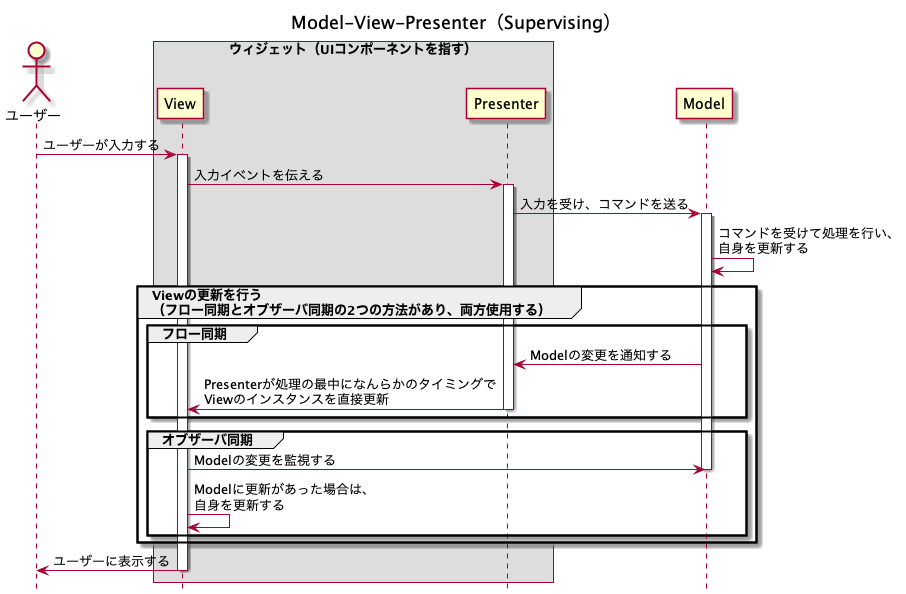

# 「iOSアプリ設計パターン入門」から学ぶ、設計の基礎

## 2種類のアーキテクチャ

- GUIアーキテクチャ
- システムアーキテクチャ

- Presentation Domain Separation（PDS）
  - ドメイン（Modelと呼ばれ、システム本来の関心領域）を、プレゼンテーション（Viewと呼ばれ、UIに関するロジック）から引き離す
  - PDSを実践する際の具体的なレイヤー構造をパターンとして示すのが、GUIアーキテクチャ

## GUIアーキテクチャ

### Model-View-Controller（MVC）モデル

#### UML

#### 特徴

- ウィジェット単位でプレゼンテーションロジックとドメインを分離する
- Modelの変更にたいし、オブザーバー 同期が行われる

#### 課題

- プレゼンテーションロジックの表現ができない
- プレゼンテーション状態を表現できない
- テストが難しい

### Presentation Modelパターン（Application Modelパターン）

#### UML

#### 特徴

- Presentation Modelに、プレゼンテーションロジックやプレゼンテーション状態の管理を担わせる
- MVCパターンの3つの課題を全て解決できる
  - ロジックがViewから切り離されていれば、Viewのインスタンスを用意しなくてもテスト可能
- AspectAdaptorなどの仕組みの導入
  - SwiftでいうKeyPathによるKVOのようなもので、Modelが更新された時の動作をプロパティの指定だけで簡単に描けるようにサポートしてくれている（よくわからん）
    - 参考：[The power of key paths in Swift](https://www.swiftbysundell.com/articles/the-power-of-key-paths-in-swift/)

#### 課題

- 特になし？

### Model-View-ViewModel（MVVM）

#### UML

#### 特徴

- 構造は、Application Modelとほぼ変わらないが、**Controllerのレイヤーが存在しない**
- ViewのテンプレートをXAML（XMLベースのDSL）で宣言する
- その宣言に従い、システムが実行時に自動的にViewとViewModelをバインドするため、コードを書かずともViewModelの状態がViewへ反映される
- Viewクラスは動的に

#### 課題（デメリット）

- 大きなアプリケーションのためのアーキテクチャであり、単純なアプリケーションに置いては実装コストが「オーバーキル」（過剰）である
- 大きなアプリケーションであったとしても、データバインディングがメモリ効率に影響を与える可能性がある

#### 参考

- SwiftUIは、MVVMに相当すると考えられる
  - 開発者から見て、アノテーションをつけることで自動的にViewModelの状態が自動的にViewへ反映される
  - [メモアプリ開発でSwiftUIによるMVVMを学んでみた](https://tech-blog.rakus.co.jp/entry/20210331/swift)
- [MVVMでiOSアプリをつくってみた](https://qiita.com/am10/items/b35355df807105600f51)

### Model-View-Presenter（MVP）

- 以下3つのMVPが存在する
  - MVP（Taligent）
  - MVP（Supervising Controller）
  - MVP（Passive View）

#### MVP（Taligent）

- MVCのそれぞれの責務をさらに細かく分割し、Controllerを一般化した存在として、Presenterを置いた
- Presenterは、アプリケーション全ての入力イベントを管理する

#### MVP（Supervising Controller）

- Viewの特徴
  - MVCのViewとは異なり、ユーザー操作の受付をContollerではなく、Viewで行う
  - Viewが直接Modelの変更を監視する
    - オブザーバ同期
    - フロー同期
- Presenterの特徴
  - Application Modelに似ているが、よりViewに近いレイヤー
    - Application Modelは、Modelに属する
  - Viewの実体を直接知っている
    - 複数のViewのインスタンスを管理し、それらを階層的に取り扱う
- Modelの特徴
  - 純粋なドメインロジックの表現

#### MVP（Passive View）

- テストしやすい、TDDサイクルを回せるアーキテクチャ
- Passive View
  - オブザーバ同期をやめたView
  - Viewが完全に受動的な存在に
- Appleが提唱する「Cocoa MVC」はMVP（Passive View）のことと考えて良い

### Flux

#### UML

#### 特徴

- 単一方向のデータフロー

### Redux

#### 特徴

- Fluxを発展させ、関数型言語のElmの影響を大きく受けたアーキテクチャ

## システムアーキテクチャ

- ドメインの先でどのようにレイヤーを切り分けるべきか、システム全体をどのように接合すべきかを示す仕組みのこと

### レイヤードアーキテクチャ

- 関心によってレイヤーを分ける
- Domain層がData層に