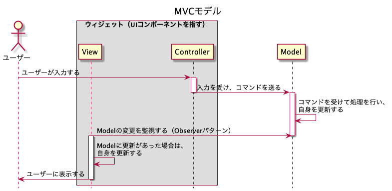
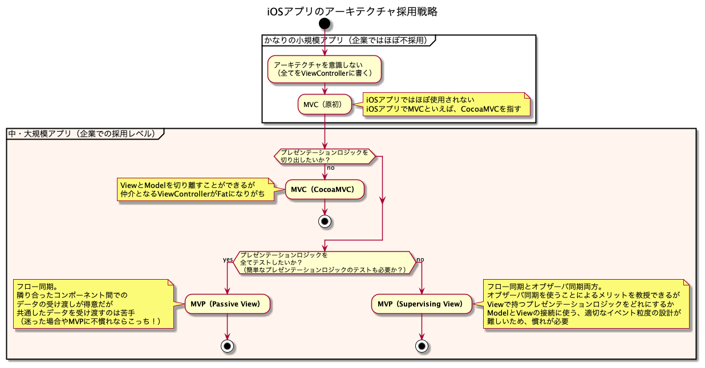

# 「iOSアプリ設計パターン入門」から学ぶ、設計の基礎

## Table of Contents
<!-- START doctoc generated TOC please keep comment here to allow auto update -->
<!-- DON'T EDIT THIS SECTION, INSTEAD RE-RUN doctoc TO UPDATE -->

Details

- [2種類のアーキテクチャ](#2%E7%A8%AE%E9%A1%9E%E3%81%AE%E3%82%A2%E3%83%BC%E3%82%AD%E3%83%86%E3%82%AF%E3%83%81%E3%83%A3)
- [GUIアーキテクチャ](#gui%E3%82%A2%E3%83%BC%E3%82%AD%E3%83%86%E3%82%AF%E3%83%81%E3%83%A3)
  - [Model-View-Controller（MVC）モデル](#model-view-controllermvc%E3%83%A2%E3%83%87%E3%83%AB)
    - [UML](#uml)
    - [特徴](#%E7%89%B9%E5%BE%B4)
    - [実装](#%E5%AE%9F%E8%A3%85)
    - [課題](#%E8%AA%B2%E9%A1%8C)
  - [Presentation Modelパターン（Application Modelパターン）](#presentation-model%E3%83%91%E3%82%BF%E3%83%BC%E3%83%B3application-model%E3%83%91%E3%82%BF%E3%83%BC%E3%83%B3)
    - [UML](#uml-1)
    - [特徴](#%E7%89%B9%E5%BE%B4-1)
    - [課題](#%E8%AA%B2%E9%A1%8C-1)
  - [Model-View-ViewModel（MVVM）](#model-view-viewmodelmvvm)
    - [UML](#uml-2)
    - [特徴](#%E7%89%B9%E5%BE%B4-2)
    - [課題（デメリット）](#%E8%AA%B2%E9%A1%8C%E3%83%87%E3%83%A1%E3%83%AA%E3%83%83%E3%83%88)
    - [参考](#%E5%8F%82%E8%80%83)
  - [Model-View-Presenter（MVP）](#model-view-presentermvp)
    - [MVP（Taligent）](#mvptaligent)
    - [MVP（Supervising Controller）](#mvpsupervising-controller)
    - [MVP（Passive View）](#mvppassive-view)
  - [Flux](#flux)
    - [UML](#uml-3)
    - [特徴](#%E7%89%B9%E5%BE%B4-3)
  - [Redux](#redux)
    - [特徴](#%E7%89%B9%E5%BE%B4-4)
  - [その他の整理](#%E3%81%9D%E3%81%AE%E4%BB%96%E3%81%AE%E6%95%B4%E7%90%86)
    - [データの2つの同期方法](#%E3%83%87%E3%83%BC%E3%82%BF%E3%81%AE2%E3%81%A4%E3%81%AE%E5%90%8C%E6%9C%9F%E6%96%B9%E6%B3%95)
    - [「iOSアプリ設計パターン入門」を読んで考えたアーキテクチャ採用戦略](#ios%E3%82%A2%E3%83%97%E3%83%AA%E8%A8%AD%E8%A8%88%E3%83%91%E3%82%BF%E3%83%BC%E3%83%B3%E5%85%A5%E9%96%80%E3%82%92%E8%AA%AD%E3%82%93%E3%81%A7%E8%80%83%E3%81%88%E3%81%9F%E3%82%A2%E3%83%BC%E3%82%AD%E3%83%86%E3%82%AF%E3%83%81%E3%83%A3%E6%8E%A1%E7%94%A8%E6%88%A6%E7%95%A5)
    - [MVPのSupervising ViewとPassive View](#mvp%E3%81%AEsupervising-view%E3%81%A8passive-view)
- [システムアーキテクチャ](#%E3%82%B7%E3%82%B9%E3%83%86%E3%83%A0%E3%82%A2%E3%83%BC%E3%82%AD%E3%83%86%E3%82%AF%E3%83%81%E3%83%A3)
  - [レイヤードアーキテクチャ](#%E3%83%AC%E3%82%A4%E3%83%A4%E3%83%BC%E3%83%89%E3%82%A2%E3%83%BC%E3%82%AD%E3%83%86%E3%82%AF%E3%83%81%E3%83%A3)
  - [Hexagonal Architecture（Ports And Adapters Architecture）](#hexagonal-architectureports-and-adapters-architecture)
    - [参考](#%E5%8F%82%E8%80%83-1)
  - [Onion Architecture](#onion-architecture)
    - [参考](#%E5%8F%82%E8%80%83-2)
  - [Clean Architecture](#clean-architecture)
- [モバイルアプリにおけるアーキテクチャ](#%E3%83%A2%E3%83%90%E3%82%A4%E3%83%AB%E3%82%A2%E3%83%97%E3%83%AA%E3%81%AB%E3%81%8A%E3%81%91%E3%82%8B%E3%82%A2%E3%83%BC%E3%82%AD%E3%83%86%E3%82%AF%E3%83%81%E3%83%A3)
  - [CoordinatorパターンとMVVM-C](#coordinator%E3%83%91%E3%82%BF%E3%83%BC%E3%83%B3%E3%81%A8mvvm-c)
    - [参考](#%E5%8F%82%E8%80%83-3)
  - [RouterパターンとVIPER](#router%E3%83%91%E3%82%BF%E3%83%BC%E3%83%B3%E3%81%A8viper)

<!-- END doctoc generated TOC please keep comment here to allow auto update -->

## 2種類のアーキテクチャ

- GUIアーキテクチャ
- システムアーキテクチャ

- Presentation Domain Separation（PDS）
  - ドメイン（Modelと呼ばれ、システム本来の関心領域）を、プレゼンテーション（Viewと呼ばれ、UIに関するロジック）から引き離す
  - PDSを実践する際の具体的なレイヤー構造をパターンとして示すのが、GUIアーキテクチャ

## GUIアーキテクチャ

### Model-View-Controller（MVC）モデル

#### UML

#### 特徴

- ウィジェット単位でプレゼンテーションロジックとドメインを分離する
- Modelの変更にたいし、オブザーバー 同期が行われる

#### 実装

- Model
  - NotificationCenterを使用して、Modelの変更をViewとControllerに通知できるようにする
    - [【Swift】NotificationCenterの使い方](https://qiita.com/ryo-ta/items/2b142361996657463e5f)
    - [NotificationCenter.addObserverのドキュメントがわからない](https://qiita.com/eytyet/items/2690c570088a062b4afc)
    - [iOSアプリのしくみ・アプリ内通知](https://note.com/kaigian/n/n62db4f735068#T1LjS)
  - didSetを使い、変数の変更を通知する
    - [Swiftのプロパティ監視willset/didset](http://tc-kazuki.hatenablog.jp/entry/2017/11/17/134050)
- Controller
  - Modelに処理を依頼するため、Modelをプロパティとして保持する（だが、更新通知は受け取らない）
  - Viewで定義するUIコンポーネントのイベントを直接受け取るために、`@objc`修飾子をつける
    - イベントを受け取ったら、Modelに処理を依頼する
  - 実装時に必要になった知識
    - 必須イニシャライザ
      - サブクラスでの実装が必須となる
      - [Swiftとイニシャライザ](https://qiita.com/shtnkgm/items/8b7979fc84a3cc065238)
    - メタタイプ（Type）
      - `type(of:)`で型を取得でき、`String.Type`のようになる
      - [[Swift 3] 型名を取得する](https://dev.classmethod.jp/articles/swift-3-type-of/)
      - [Swift Type Metadata (ja)](https://kateinoigakukun.hatenablog.com/entry/2019/03/22/180030)
    - 循環参照を起こさせない`[unowned self]`
      - キャプチャ`[]`で囲うとその後その変数に何を代入しても代入前の値を見るようになる
      - [普段なにげなく書いている[unowned self]の意味を調べる](https://qiita.com/shimesaba/items/f433de0850bf09a1d50d)

#### 課題

- プレゼンテーションロジックの表現ができない
- プレゼンテーション状態を表現できない
- テストが難しい

### Presentation Modelパターン（Application Modelパターン）

#### UML

#### 特徴

- Presentation Modelに、プレゼンテーションロジックやプレゼンテーション状態の管理を担わせる
- MVCパターンの3つの課題を全て解決できる
  - ロジックがViewから切り離されていれば、Viewのインスタンスを用意しなくてもテスト可能
- AspectAdaptorなどの仕組みの導入
  - SwiftでいうKeyPathによるKVOのようなもので、Modelが更新された時の動作をプロパティの指定だけで簡単に描けるようにサポートしてくれている（よくわからん）
    - 参考：[The power of key paths in Swift](https://www.swiftbysundell.com/articles/the-power-of-key-paths-in-swift/)

#### 課題

- 特になし？

### Model-View-ViewModel（MVVM）

#### UML

#### 特徴

- 構造は、Application Modelとほぼ変わらないが、**Controllerのレイヤーが存在しない**
- ViewのテンプレートをXAML（XMLベースのDSL）で宣言する
- その宣言に従い、システムが実行時に自動的にViewとViewModelをバインドするため、コードを書かずともViewModelの状態がViewへ反映される
- Viewクラスは動的に

#### 課題（デメリット）

- 大きなアプリケーションのためのアーキテクチャであり、単純なアプリケーションに置いては実装コストが「オーバーキル」（過剰）である
- 大きなアプリケーションであったとしても、データバインディングがメモリ効率に影響を与える可能性がある

#### 参考

- SwiftUIは、MVVMに相当すると考えられる
  - 開発者から見て、アノテーションをつけることで自動的にViewModelの状態が自動的にViewへ反映される
  - [メモアプリ開発でSwiftUIによるMVVMを学んでみた](https://tech-blog.rakus.co.jp/entry/20210331/swift)
- [MVVMでiOSアプリをつくってみた](https://qiita.com/am10/items/b35355df807105600f51)

### Model-View-Presenter（MVP）

- 以下3つのMVPが存在する
  - MVP（Taligent）
  - MVP（Supervising Controller）
  - MVP（Passive View）

#### MVP（Taligent）

- MVCのそれぞれの責務をさらに細かく分割し、Controllerを一般化した存在として、Presenterを置いた
- Presenterは、アプリケーション全ての入力イベントを管理する

#### MVP（Supervising Controller）

- Viewの特徴
  - MVCのViewとは異なり、ユーザー操作の受付をContollerではなく、Viewで行う
  - Viewが直接Modelの変更を監視する
    - オブザーバ同期
    - フロー同期
- Presenterの特徴
  - Application Modelに似ているが、よりViewに近いレイヤー
    - Application Modelは、Modelに属する
  - Viewの実体を直接知っている
    - 複数のViewのインスタンスを管理し、それらを階層的に取り扱う
  - 1つのViewにつき、1つのPresenterを作成する（Passive Viewも共通）
    - 仲介役なので、ViewとModelの双方を知っているが、どちらを依存関係の主にするかは特に定められてない。
    - ただしiOSでは、ViewControllerが不可欠なので、「ViewがPresenterを知っている状態」とし、PresenterからはViewをweak参照で持つようにする
- Modelの特徴
  - 純粋なドメインロジックの表現

- MVP（Passive View）と異なる点
  - 複雑なプレゼンテーションロジックは、Presenterが担当し、簡単なものはViewに残す
  - ViewはControllerを介さずに直接Modelの更新を検知して、プレゼンテーションロジックを担当することもある

#### MVP（Passive View）

- テストしやすい、TDDサイクルを回せるアーキテクチャ
- Passive View
  - オブザーバ同期をやめたView
  - Viewが完全に受動的な存在に
- Appleが提唱する「Cocoa MVC」はMVP（Passive View）のことと考えて良い
- MVP（Supervising View）と異なる点
  - プレゼンテーションロジックを完全に、Presenterに担当させる

- 実装時に必要になった知識
  - extensionの名付け方
    - 基本的には「拡張したいクラス名 + カテゴリ名」
      - 例えば`String+UTF8Data.swift`のように
      - 参考：[Swift で Extension につけるファイル名のベストプラクティス](https://fiveteesixone.lackland.io/2015/01/08/best-practice-for-naming-swift-extension-file-name/)
  - Protocolごとにextensionで分けて実装する
    - 理由は以下の2つ
      - 明示的に別処理であることを表すため
      - 1つのソースファイルの肥大化を避けるため
    - 参考：[【Swift】Protocolごとにextensionで切り分けて実装するワケ](https://dev.classmethod.jp/articles/protocol-extension-form/)

### Flux

#### UML

#### 特徴

- 単一方向のデータフロー

### Redux

#### 特徴

- Fluxを発展させ、関数型言語のElmの影響を大きく受けたアーキテクチャ

### その他の整理

#### データの2つの同期方法

|同期方法|概要                |メリット　　　　　|デメリット         |使用シーン|
|----------|-------------------|-----------------|-------------|---|
|フロー同期|上位レイヤーのデータを下位レイヤーに都度セットしてデータを同期する、手続き的な同期方法。|・データのフローを追いやすい   |・手続き的なので、共通したデータを参照している全ての箇所の参照を持っておく必要がある。そのために参照の管理が煩雑になりやすい。|push遷移でドリルダウンしていくような隣り合った画面間でのデータ共有|
|オブザーバ同期|関し元である下位レイヤーが関し先である上位レイヤーからObserverパターンで送られるイベント通知を受け取ってデータを同期させる、宣言的な同期方法。|・共通した複数箇所でデータを同期しやすい。|・データが変更される度に同期処理が実行されるため、いつデータが同期されるかが追いづらくなる|・ハートや星マークでのお気に入りのデータ管理のように、複数タブや階層が離れた画面でも、各画面が共通のデータ領域の変更を関ししているために、同期箇所で他の画面の参照を持つ必要がない。|

- 注意したいこと
  - コンポーネント間の距離が遠いのに、無理にフロー同期を使用しないこと！
    - 上位レイヤーが知らなくても良い下位レイヤーを知る（依存する）ことになり、データフローを追いやすいというメリットがなくなるため
  - どちらが優れているとかではなく、それぞれメリットデメリットがあるので、**設計段階でどちらを採用するか考える必要がある**

#### 「iOSアプリ設計パターン入門」を読んで考えたアーキテクチャ採用戦略

- 以下については未反映（随時更新予定）
  - MVVM
  - Flux
  - Redux

#### MVPのSupervising ViewとPassive View

- 選定基準
  - 「全てのプレゼンテーションロジックをテスト可能にしたいか？」
    - YES→Passive View
    - NO→Supervising View
  - アプリケーションで取り扱うプレゼンテーションロジックが簡単なものならば、テスト不要か？
    - YES→Supervising View
    - NO→Passive View
- 迷った場合やMVPに慣れていない場合
  - Passive Viewを選択！
    - 「Viewが持つ簡単なプレゼンテーションロジック」の「簡単、」の判断が難しいため

## システムアーキテクチャ

- ドメインの先でどのようにレイヤーを切り分けるべきか、システム全体をどのように接合すべきかを示す仕組みのこと

### レイヤードアーキテクチャ

- 関心によってレイヤーを分ける
- Domain層がData層に依存しないよう、Dependency Injection（依存オブジェクトの注入）を行った
  - それにより、Data層へのドメイン知識の漏洩は防がれる

### Hexagonal Architecture（Ports And Adapters Architecture）

- iOSにおけるプライマリアダプターとセカンダリアダプター

- Presentation層でも、Domain層にあるべきドメイン知識が漏洩しがちだったが、それを防ぐ
  - DataやPresentation層を「外部との接続に関するレイヤー」として捉える
- ポートとアダプターの概念がある
  - ポート
    - 外部との接続
    - 目的の単位で抽象化される
  - アダプター
    - 差し込まれた外部モジュールの実装詳細を隠蔽し、ポートが期待するインターフェースへの変換する
    - プライマリアダプター
      - アプリケーションを駆動するためのもの
    - セカンダリアダプター
      - アプリケーションによって駆動されるためのもの

#### 参考

- [Hexagonal Architecture for iOS](https://betterprogramming.pub/hexagonal-architecture-for-ios-part-1-600441c186b7)

### Onion Architecture

- 基本的な考えは、Hexagonal Architectureと変わりない
- 同じく、Data層を外側におき、Adapterパターンによってアプリケーションを疎結合に保つもの
- Hexagonal Architectureとの違い
  - アプリケーションの視覚表現として、六角形ではなく円を用いている
  - アプリケーション内部を複数の円で分割している
- 円の中心にあるのは、モデルの状態と振る舞いを表現するDomain Model
  - **Domain ServiceやApplication Serviceがあるが、必ずしもそのレイヤーに分かれている必要はない**
- 4つの特徴
  - アプリケーションは自立したオブジェクトモデルを取り囲むように作られる
  - 内側のレイヤーはインターフェースを定義し、外側のレイヤーはそれを実装する
  - 依存の方向は外側から内側
  - Application Coreはインフラストラクチャ（Data層）抜きでコンパイル・実行できる

#### 参考

- [[DDD]ドメイン駆動 + オニオンアーキテクチャ概略](https://qiita.com/little_hand_s/items/2040fba15d90b93fc124)

### Clean Architecture

- 今まで提唱された様々なアーキテクチャを統合したもの

## モバイルアプリにおけるアーキテクチャ

- 画面遷移をどう設計するか

### CoordinatorパターンとMVVM-C

- アプリのルートに存在するApplicaion Coordinatorを頂点とした階層構造によって画面遷移を表現する
- 一般的には、画面遷移を行う場合は、View Controller内で次のView Controllerをインスタンス化し、Navigation ControllerへのpushやModalのpresentを行うが、それだと、View Controllerは次のView Controllerを指定いる必要がある。
  - 遷移先が複数存在する場合や、使いまわしたい場合に、遷移ロジックが肥大化するのを防ぐ

#### 参考

- [How to use the Coordinator pattern in iOS](https://www.youtube.com/watch?v=7HgbcTqxoN4)

### RouterパターンとVIPER

- 「View」「Iteractor」「Presenter」「Entity」「Routing」
- Clean Architecture +  MVP（Passive View） + Router
  - RouterはPresenterに画面遷移を指示する
- Routerの役割
  - 遷移先のView Controllerの生成
  - 遷移先のView Controllerが依存するコラボレーターの生成と代入
  - 画面遷移の実施方法の定義